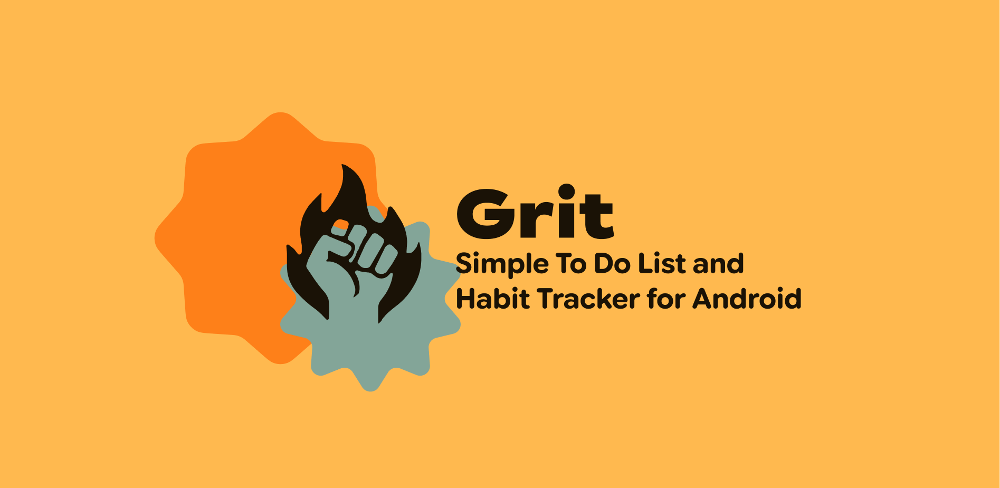
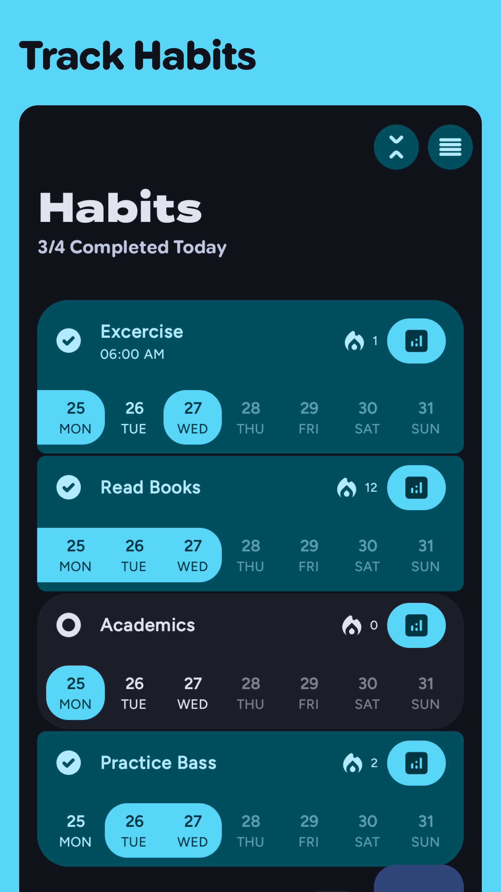
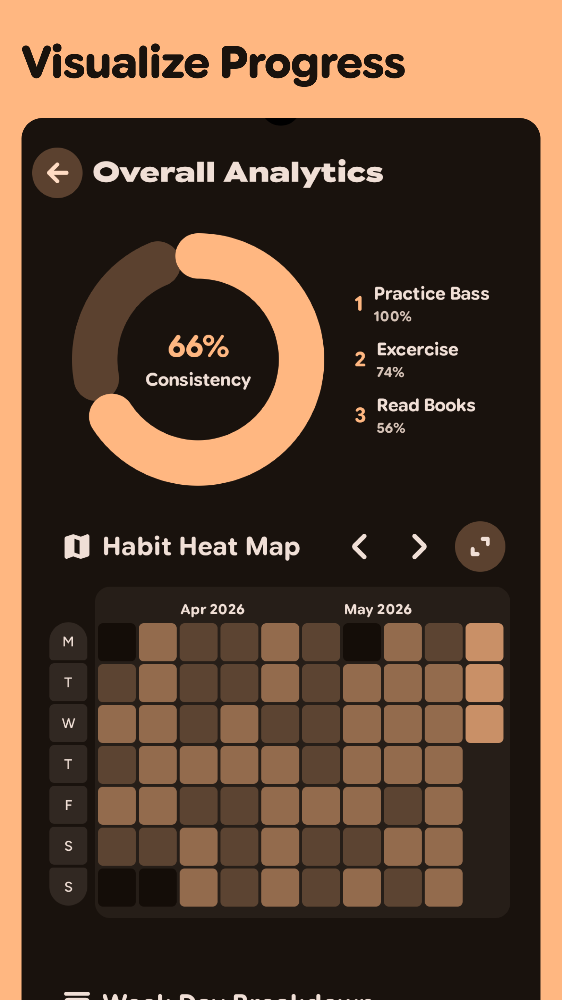
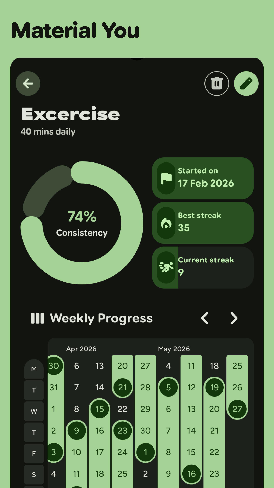
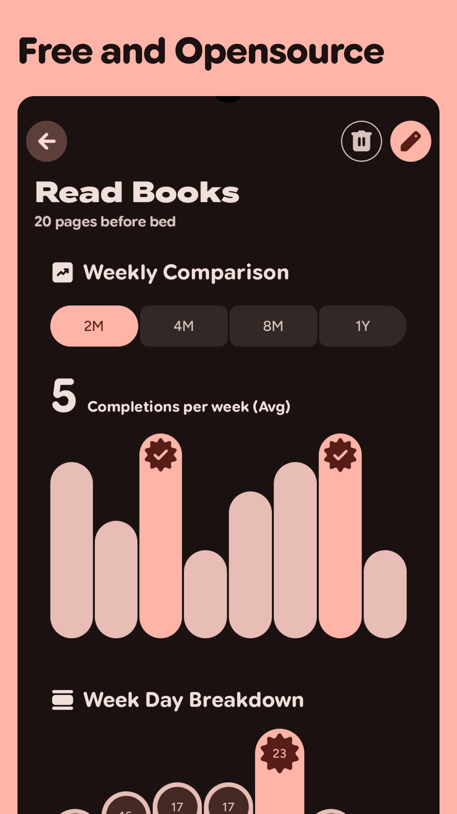
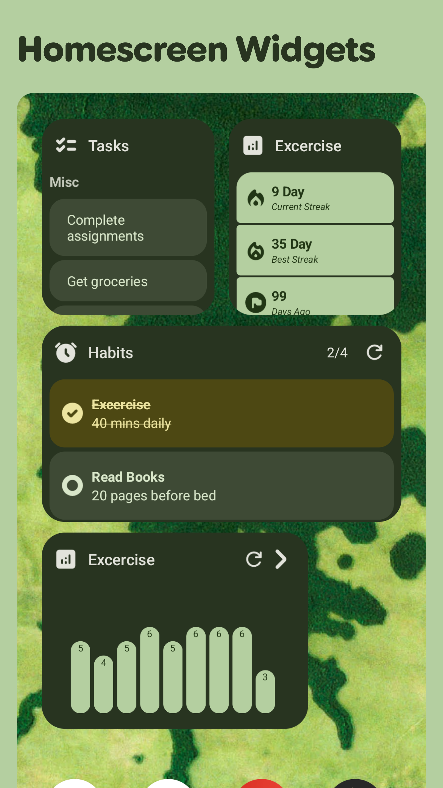

> [!CAUTION]
> ## [Keep Android Open](https://keepandroidopen.org/)
> ###  Your phone is about to stop being yours.
> Starting September 2026, a silent update, nonconsensually pushed by Google, will block every
> Android app whose developer hasn't registered with Google, signed their contract, paid up, and
> handed over government ID.
> **Every app and every device, worldwide, with no opt-out.**



[](https://shub39.github.io/Grit)
[](https://play.google.com/store/apps/details?id=com.shub39.grit)
[](https://github.com/shub39/Grit/releases)
[](https://apt.izzysoft.de/fdroid/index/apk/com.shub39.grit)
[](https://f-droid.org/en/packages/com.shub39.grit/)

# 本分支 DIY 定制说明（中文）

> 本仓库在原版 [Grit](https://github.com/shub39/Grit) 基础上做了一系列个人向的定制与优化，
> 以下按主题简要记录整个 DIY 过程。

## 颜色优化
- 为 App 与桌面小组件引入 **液态玻璃（liquid glass）** 视觉风格，半透明磨砂 + 渐变，界面更通透。
- 支持 **每个分类 / 每个习惯的强调色（accent color）**，并按列表位置生成深浅变体（shade variants），避免整块纯色。

## UI 优化
- 新增 **「今天」视图**：跨分类聚合当天要做的任务。
- 底部导航改为仿 iOS 26 的液态玻璃胶囊，选中项展开显示文字。
- 修复玻璃修饰符导致的底部弹窗（ModalBottomSheet）异常；小组件支持自定义文字大小。

## 逻辑细化
- 任务支持 **描述、可勾选的子步骤（steps）**；分类支持「隐藏已完成」。
- 习惯支持 **子步骤**，小组件可限定分类范围。

## AI
- 接入 **DeepSeek**，可对任务 / 习惯进行 **AI 智能分解**，一键生成步骤（密钥经 `local.properties` → `BuildConfig` 注入）。

## 本次新增的三项任务
1. **任务详情独立成页**：点击任务详情不再从底部「拉起」弹窗，而是打开一个独立界面；且新界面 **焦点不落在输入框**，避免一进入就弹出键盘。
2. **习惯截止日期 + 假日跳过**：习惯新增可选 **截止日期**；打卡状态由「完成 / 未完成」两态扩展为 **完成 → 跳过（假日占位）→ 未完成** 三态循环。跳过日在连续打卡（streak）与连贯性统计中视为中性，不会中断连击、也不计入分母。
3. **独立统计界面**：在导航栏新增与「设置」同级的 **统计** 界面，可选择 **单个习惯 / 所有习惯** 查看热力图与连贯性，并可按 **单个分类 / 所有分类** 查看任务完成率。

> 数据层：习惯数据库升级至 schema v7（`habit_status.skipped`、`habit_index.deadline` 两列，均带默认值，走 Room AutoMigration 6→7），备份/恢复格式同步兼容。

# Screenshots

|  |  |
|:-------------------------------------------------------------------------:|:-------------------------------------------------------------------------:|
|  |  |
|  |  |

# Features

- [x] Todo List with reminders
- [x] Daily Habit Tracking
- [x] Analytics with Habit Maps
- [x] Notification Reminders
- [x] Widgets

Check out planned changes in [RoadMap](https://github.com/shub39/Grit/discussions/66)

# Motivation 

There are plenty of todo list and habit tracker apps for android. Some have the features I love while some have good UI design.
While learning android I made this app for myself that brings together all the features that I like keeping everything simple. 
I eventually want to turn this app into a productivity hub with many social features like progress sharing in the form of beautiful cards.

# Stargazers over time

[](https://starchart.cc/shub39/Grit)

## Translations

Translations are done via weblate, you can contribute there!
[](https://hosted.weblate.org/engage/grit/)
[](https://hosted.weblate.org/engage/grit/)

# Inspiration and Tech used

- [Loop Habit Tracker](https://github.com/iSoron/uhabits)
- Kotlin and Jetpack Compose 🖤
- Compose Multiplatform and Kotlin wasm for the Web Demo
- [Compose Reorderable](https://github.com/Calvin-LL/Reorderable)
- [MaterialKolor](https://github.com/jordond/MaterialKolor)
- [ColorPicker Compose](https://github.com/skydoves/colorpicker-compose)
- [Compose Calendar](https://github.com/boguszpawlowski/ComposeCalendar)
- [Revenuecat Android SDK](https://github.com/RevenueCat/purchases-android)

# Contributing

Please read [CONTRIBUTING.md](CONTRIBUTING.md) for details on our code of conduct, and the process for submitting pull requests.

# Security

SHA-256 fingerprint for the signing certificate used for github releases
```text
0F:E1:B9:F4:4A:4D:B9:7E:C5:09:48:F5:18:9F:6B:43:00:71:6C:C6:D4:84:3F:56:98:D6:14:A2:15:2E:21:88
```